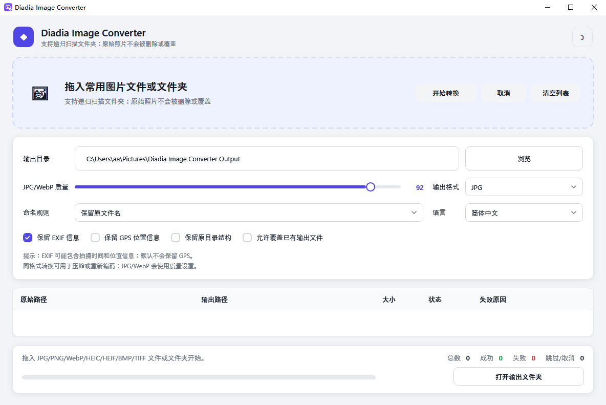
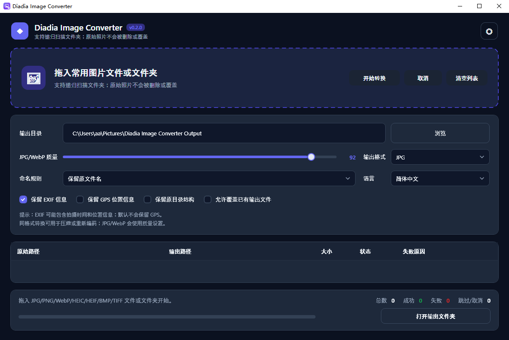

# Diadia Image Converter

A modern, privacy-first Windows desktop app for **batch converting images** between
JPG, PNG, WebP, BMP, TIFF and HEIC/HEIF. It is built around one rule: **your original
photos are never deleted and never overwritten**.

[](https://github.com/dosheda/ImageConverter/actions/workflows/ci.yml)
[](https://github.com/dosheda/ImageConverter/releases/latest)
[](https://github.com/dosheda/ImageConverter/releases)
[](LICENSE)


### 🌞 Light theme



### 🌙 Dark theme



> **Download:** grab the latest Windows x64 portable build from the
> [**Releases**](https://github.com/dosheda/ImageConverter/releases) page.

---

## Features

- **Drag & drop** single files or whole folders (folders are scanned recursively).
- **Inputs:** `.jpg` `.jpeg` `.png` `.webp` `.heic` `.heif` `.bmp` `.tif` `.tiff`.
  Unsupported files in a folder are ignored, with a count shown at the bottom.
- **Outputs:** JPG, PNG, WebP, BMP, TIFF (JPG by default).
- **Same-format re-encoding** (e.g. WebP → WebP, JPG → JPG) for compression.
- Adjustable **JPG/WebP quality**, output directory, naming rule, and folder-structure preservation.
- **EXIF handling:** keep EXIF metadata, with **GPS stripped by default** for privacy.
- **Safe writes:** files are written to a temporary path first, then moved into place.
  Duplicate names get `_1`, `_2`… suffixes instead of overwriting (unless you opt in).
- **Resumable:** cancel mid-run and press Start again — already-converted files are skipped.
- **Non-blocking UI:** conversion runs in the background; the window never freezes.
- **Light / Dark themes** with a one-click toggle, remembered between sessions.
- **14 UI languages:** 简体中文 · 繁體中文 · English · Čeština · Deutsch · Español ·
  Français · Italiano · 日本語 · 한국어 · Polski · Português (Brasil) · Русский · Türkçe.
- Three **naming rules:**
  - Keep original name: `IMG_1234.HEIC → IMG_1234.jpg`
  - Capture date/time + name: `IMG_1234.HEIC → 2024-08-12_15-32-08_IMG_1234.jpg`
  - Date + name: `IMG_1234.HEIC → 2024-08-12_IMG_1234.jpg`
- Settings are saved to your user profile; every run writes a log to the app's `logs` folder.

## Getting started

Requires the [.NET 9 SDK](https://dotnet.microsoft.com/download) on Windows 10/11.

```powershell
# Build
dotnet build

# Run
dotnet run --project .\src\DiadiaHeicConverter.App\DiadiaHeicConverter.App.csproj

# Test
dotnet test

# Publish a self-contained portable build
dotnet publish .\src\DiadiaHeicConverter.App\DiadiaHeicConverter.App.csproj `
  -c Release -r win-x64 --self-contained true -o .\artifacts\DiadiaImageConverter-win-x64
```

## How to convert

1. Launch Diadia Image Converter.
2. Drag image files or a folder onto the drop zone.
3. Choose an output directory.
4. Adjust output format, JPG/WebP quality, naming rule, EXIF/GPS, folder structure and overwrite as needed.
5. (Optional) Switch UI language, or toggle the light/dark theme (top-right).
6. Click **Start**.
7. When finished, click **Open output folder**.

## Tech stack

- **.NET 9 + WPF** — Windows desktop UI.
- **MVVM** via [`CommunityToolkit.Mvvm`](https://www.nuget.org/packages/CommunityToolkit.Mvvm).
- **[Magick.NET](https://github.com/dlemstra/Magick.NET)** (`Magick.NET-Q16-x64`, Apache-2.0) — the image decode/encode engine.

The codebase is layered into `Models`, `Services` (interface + implementation pairs),
`ViewModels` and `Views`, with the conversion logic fully isolated in services and
covered by unit tests.

## Privacy & safety

- Runs **fully offline** — no image is ever uploaded and no cloud service is contacted.
- The app has **no feature to delete original files**.
- Output is never overwritten unless you explicitly enable it.
- Logs record input/output paths and success/failure status — avoid sharing logs that
  contain private paths.

## A note on HEIC / HEIF

HEIC/HEIF support relies on the ImageMagick / libheif / HEVC (H.265) stack bundled with
Magick.NET. HEVC/H.265 may carry **patent or licensing obligations** depending on your
region and use case. Some exotic HEIC encodings may also fail to decode. Before shipping
a commercial distribution, review the dependency chain, binary distribution method and the
compliance requirements of your target market.

## Known limitations

- Static images only — no multi-frame export for GIF or animated WebP.
- PNG/BMP/TIFF do not currently expose dedicated compression parameters (the quality
  slider applies to JPG/WebP).
- No installer yet; the MVP ships as a Windows x64 portable build.

## License

Released under the [MIT License](LICENSE). Note that bundled third-party components
(ImageMagick/libheif/HEVC) carry their own licenses and, in the case of HEVC, potential
patent considerations — see the note above.

---

## 中文说明

Diadia Image Converter 是一个**注重隐私的 Windows 桌面批量图片转换工具**，支持在
JPG、PNG、WebP、BMP、TIFF、HEIC/HEIF 之间互转。核心原则：**绝不删除、绝不覆盖你的原始图片**。

**主要特性**

- 拖拽单个文件或整个文件夹（递归扫描子目录），不支持的文件自动忽略并计数提示。
- 输出 JPG / PNG / WebP / BMP / TIFF；支持同格式重新编码用于压缩。
- 可调 JPG/WebP 质量、输出目录、命名规则、目录结构保留。
- 支持保留 EXIF，**默认剥离 GPS 位置信息**。
- 先写临时文件再移动到最终路径；重名自动加 `_1`、`_2` 后缀，默认不覆盖。
- 取消后再次开始会**续跑**，已成功的文件不重复转换；转换在后台执行，界面不卡死。
- **亮 / 暗主题**一键切换并记忆；**14 种界面语言**。

**运行**

```powershell
dotnet build
dotnet run --project .\src\DiadiaHeicConverter.App\DiadiaHeicConverter.App.csproj
dotnet test
```

**隐私**：软件完全离线运行，不上传图片、不连接云端；没有删除原文件的功能。日志会记录
输入/输出路径与成功/失败状态，请勿公开分享含隐私路径的日志。

**HEIC/HEIF 提示**：解码依赖 ImageMagick / libheif / HEVC(H.265)，HEVC 在部分地区/用途下
可能涉及专利或授权问题，正式商用分发前请自行确认合规。
